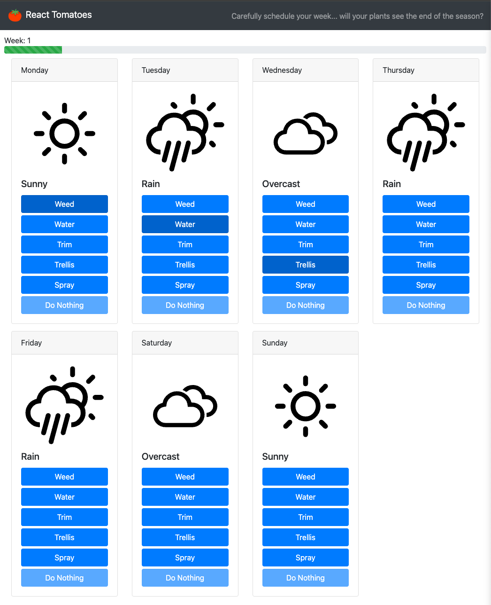

# react-tomatoes

A react version of the game Field Tomatoes, originally written in Kotlin as a prompt for a job I didn't get.
Built with react, react-bootstrap, typescript, create-react-app and jest.

### Goal
To make it through the season without losing your crop!

### Game play
Make a work schedule for each week, based on the weather forecast. Try and figure out the weather and work combo to make it to the end!

Have fun, good luck!

